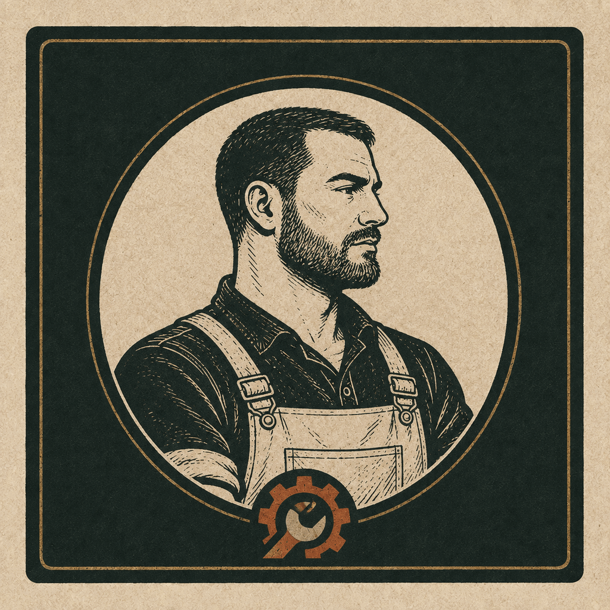
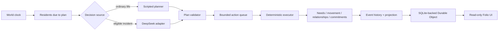

# Town

**A persistent small-world simulation about people, routines, relationships, and consequences that keep moving after you close the tab.**

The world is **Calder Station**: fifteen residents living across fourteen places, carrying needs, routines, relationships, commitments, and a growing event history. The project is an experiment in making an AI-assisted simulation feel less like a room full of chatbots and more like a place with an actual clock.

<p align="center">
  
  
  
  
</p>

## The idea

Town is not fifteen language-model sessions talking forever.

Residents are durable records inside a deterministic simulation. Ordinary code owns the world clock, needs, movement, locations, relationships, obligations, action timing, and consequences. A model may occasionally propose a **bounded intent**; that intent still has to pass the same validator and executor as every scripted decision.

That split is the point. Language models are good at choosing among messy human possibilities. They are much less trustworthy as clocks, databases, physics engines, or gods.

So Town gives the model a vote, not the keys.

## Calder Station today

The authored world currently contains:

- 15 residents
- 14 places
- 27 relationship edges
- staggered daily planning turns
- bounded intra-day action queues
- persistent needs, locations, relationships, and commitments
- an append-only event history
- a renewable commitment chain with downstream relationship consequences
- a read-only folio UI with a town register, map, resident pages, histories, and portraits

Most decisions are still scripted on purpose. The current model experiment is deliberately narrow: **Sal D'Amico** can use DeepSeek when deciding what to do about an open commitment involving **Jamie Allen's notice**. The model gets compact context and must return a legal structured choice. If it times out, fails validation, or returns nonsense, deterministic fallback rules take over.

This is still an experiment, not a finished artificial society. The current phase is about finding out whether a small world can remain coherent and interesting over long spans of simulated time before adding more people, more model calls, or more machinery.

## How it works



A planning turn produces a short ordered plan of at most five actions. The executor schedules those actions through the day and remains authoritative about what actually happens. Hard needs can interrupt an intention. A later planning turn can supersede unfinished work. Commitments can be fulfilled, delayed, missed, and renewed, but every loop has explicit caps.

There is no hidden resident process and no model-managed clock.

## Long-horizon simulation

The interesting question is not whether Calder Station looks plausible for five minutes. It is whether the rules still make sense after a week, a month, or a season.

The scenario runner starts a fresh in-memory town and advances the **same simulation engine used by production** through requested checkpoints:

```sh
npm run scenario -- --days 1,7,30,90
npm run scenario -- --days 90 --seed another-replay --json
```

Reports track event volume, resident plans and actions, relationship changes, commitment outcomes and generations, activity by place, model attempts and fallbacks, token use, need ranges, queue state, and invariant failures. Runs are seedable and replayable so rule changes can be compared without inventing a second fake simulation for testing.

The current milestone is simple: a fresh Calder Station should survive 90 simulated days and accumulate understandable causal differences instead of producing ninety copies of the same day.

## Run it locally

The test suite uses Node's built-in test runner:

```sh
npm test
```

Run the dashboard and Worker locally with Wrangler:

```sh
npx wrangler dev
```

The Worker serves the Folio UI and read-only routes for `/`, `/map`, `/residents`, and `/residents/:id`. Explicit `?ticks=` requests create ephemeral inspection replays and are capped at 48 ticks; they do not mutate the persistent production town.

## Design constraints

A few rules keep this project from quietly turning into an expensive haunted spreadsheet:

- residents are records, not permanently running agent processes;
- deterministic code owns legality, state transitions, timing, and consequences;
- model output is structured, bounded, validated, and replaceable with a fallback;
- action queues and renewable commitment chains have hard caps;
- state changes remain inspectable through event history and replayable seeds;
- production state is persistent and protected from casual resets;
- staging state is isolated and disposable;
- the browser is a viewer, not a second simulation engine;
- infrastructure is added only when the simulation demonstrates an actual need for it.

That currently means one SQLite-backed Cloudflare Durable Object coordinator. No D1, Queues, Workflows, one-object-per-resident architecture, WebSocket firehose, or unbounded conversation loop until one of those things earns its keep.

## Production and staging

Deployment is intentionally manual through GitHub Actions.

- `production` deploys `town-dashboard` and preserves the persistent town.
- `staging` deploys `town-dashboard-staging` with isolated disposable state.

Both environments use `CLOUDFLARE_API_TOKEN` and `CLOUDFLARE_ACCOUNT_ID` repository secrets. `DEEPSEEK_API_KEY` is stored as a Cloudflare Worker secret only in environments that should make model calls; it is never sent to the browser.

A code commit does not automatically reset, publish, or redeploy the town.

## Repository map

| Path | What lives there |
| --- | --- |
| `src/simulation.js` | world state, action queues, execution, replay, projections |
| `src/daily-plans.js` | versioned planner contract and validation |
| `src/scripted-decisions.js` | ordinary rule-based resident intent |
| `src/deepseek-planner.js` | bounded DeepSeek decision adapter and failure handling |
| `src/obligations.js` | commitment resolution, expiry, and bounded renewal |
| `src/social.js` | deterministic co-location and relationship effects |
| `src/scenario-runner.js` | long-horizon diagnostics and invariant checks |
| `src/town-do.js` | persistent SQLite-backed Durable Object coordinator |
| `src/demo-data.js` | authored Calder Station seed and compact regression seed |
| `public/` | Folio UI, map, resident register, and portrait assets |
| `test/` | unit, integration, migration, replay, runner, and frontend tests |
| `docs/architecture.md` | deeper architecture notes and system boundaries |
| `plan.md` | current milestone, sequencing, and deliberately deferred work |

## Philosophy

The goal is not maximum agent count, maximum token spend, or maximum emergent chaos.

The goal is a world small enough to understand, persistent enough to matter, and constrained enough that when something unexpected happens, you can trace **why** it happened.

Calder Station is the test case.
